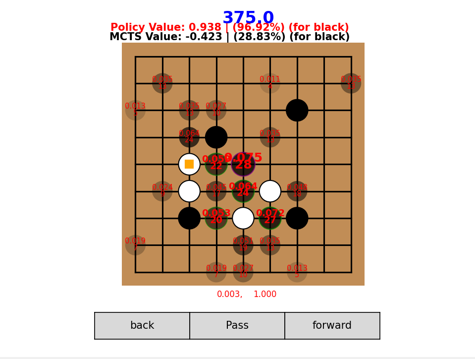

# AlphaZero-Style Go & Chess Bots

A game-playing AI built from scratch following the AlphaGo Zero approach: a PyTorch policy/value network guiding Monte Carlo Tree Search, trained through self-play. I built it for Go, then adapted the same approach to chess.



## Go (`go/`)
- **Network:** ResNet (10 residual blocks, 128 channels) with policy, value, score and ownership heads; 16 input planes relative to the player to move (stones, group liberties, illegal points, last 4 moves)
- **Search:** PUCT MCTS batched across 256 games per GPU call, Dirichlet root noise, temperature schedule, playout cap randomization; numba rules engine (Tromp-Taylor scoring, positional superko)
- **Training:** continuous self-play (96,000+ games, ~110 hours on a laptop RTX 4060), with progress measured in matches against frozen earlier models
- **Results:** beats the original version of this bot 395–5 at equal search; 100–0 against GNU Go 3.8 (level 10); provisional CGOS 9×9 rating around 2,500–2,600
- **Interactive UI:** analyze positions with live MCTS, play the bot, watch two models play, inspect policy priors and ownership, and test life-and-death puzzles

## Chess (`chess/`)
- **Network:** SE-ResNet (8 blocks, 64 channels) with GroupNorm over an 18-plane board encoding
- **Search:** batched MCTS with virtual loss, evaluating many leaves per GPU pass, with Syzygy tablebase lookups in the endgame
- **Training:** supervised pretraining on 27M+ positions (elite Lichess games plus tablebase endgames), then self-play, on an RTX 4060
- **Result:** about 1000 Elo. It plays human-like positional chess and once found a queen sacrifice leading to forced mate, but it struggles with sharp tactics, and network evaluation keeps search slow
- **Also:** a classical C# engine (`chess/csharp-engine/`): bitboards, alpha-beta search, UCI

## What I debugged
Replay buffer mis-sizing, temperature-schedule bugs, corrupted data from max-length games, eye-filling and self-atari loops in Go, and a value head that appeared to overpower the policy.

## Development notes
I wrote the original Go engine myself from the AlphaGo Zero paper (see the early commit history). The improved Go version and the chess adaptation were built with AI-assisted development (Claude); I designed the architecture and training pipeline and debugged and evaluated the models.

## Try it
Weights: [Releases](https://github.com/colinHuang314/AlphaZero-Style-Go-Bot/releases/tag/v1.0)

```bash
pip install -r requirements.txt

# Go: browser UI at http://localhost:8765
cd go
python -m gozero.ui.server --model path/to/go-zero-9x9-c439.pt

# Chess: put model_human_pretrained_7-7.pt in chess/Models/, then (opens http://localhost:5000)
python chess/AnalyzeUI2.py
```
